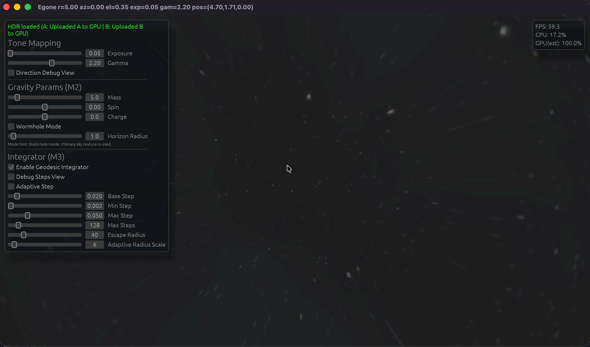
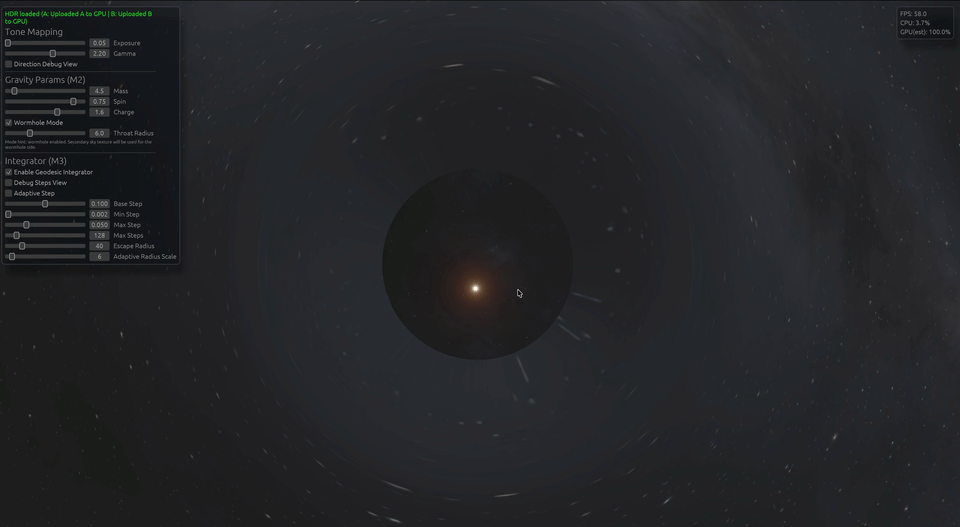

# Egone

Egone is a real-time gravitational lensing playground built with **Rust + wgpu + egui**.  
It focuses on interactive visualization of black-hole / wormhole style ray behavior, with a fast iteration loop for shader experiments and physics-driven rendering controls.

---

## Preview

### 1. Dynamic Demonstration  

<center>
  
</center>  

### 2. Black Hole Simulation  

<center>
  
</center> 

### 3. Wormhole Simulation  

<center>
  
</center>
---

## 🚀 Project Status: Work in Progress

- [x] M1: Visualization foundation (fullscreen render + sky sampling)
- [x] M2: Gravity parameter pipeline (Rust -> GPU -> Shader)
- [x] M3: Core integrator (RK4 loop + guards + adaptive step baseline)
- [x] M4: Wormhole mode core path (dual HDR + side switching baseline)
- [ ] **M5**: Stabilization, tuning, and final demo polish
- [ ] **M6**: Accretion disk visual layer

---

## Local Run

```bash
cargo run
```

---

## Asset Setup (Important)

This repository ignores `src/assets/` on purpose (see `.gitignore`), so HDR files are **not** included in git.

You need to prepare local assets manually:

1. Create folders:

```bash
mkdir -p src/assets/sky
```

2. Put your HDR files in:

- `src/assets/sky/bk.hdr` (primary background)
- `src/assets/sky/out2.hdr` (secondary background, wormhole side)

3. Run:

```bash
cargo run
```

If files are missing, rendering startup may fail or fallback behavior may be limited.

---

## How to Replace / Edit HDR Textures

### Option A: Replace directly

Use your own `.hdr` files and overwrite:

- `src/assets/sky/bk.hdr`
- `src/assets/sky/out2.hdr`

### Option B: Generate new HDRs

You can generate/edit HDR textures in tools such as:

- Blender (World HDRI workflow)
- HDRI tools / panorama tools
- Python imaging workflows (if exporting valid Radiance `.hdr`)

### Practical tips

- Prefer equirectangular HDR panoramas.
- Keep resolution moderate first (for startup speed and GPU memory).
- If your HDR is very large, consider downscaling before testing.

---

## Notes

- The app is actively evolving; milestone scopes may shift as rendering and physics improve.
- Current focus is visual correctness + stable interaction during iterative shader development.
